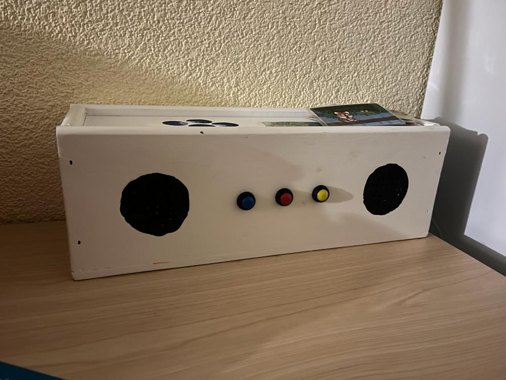

# Aribox
Very simplistic setup for a music box which runs different kind of shell scripts based on codes from NFC cards.



Project is inspired by [voss.earth "Jukebox für Kinder" blog](https://www.voss.earth/2018/03/07/wir-bauen-eine-jukebox-fuer-kinder-als-alternative-zur-toniebox/) - Most of the parts used in this Aribox, are already listed in this blog article. 

There are quite interesting concepts, e.g. switching on and off a WIFI USB dongle on a raspberry.

Thank you https://github.com/ondryaso/pi-rc522 for building the documentation and python library for the PI-RC522 :) 


## Setup

```python
sudo apt-get update
sudo apt-get install python3 python3-venv python3-pip
sudo apt-get install python3-gpiozero
sudo apt-get install python-alsaaudio
```

## Install project

```shell
pip3 install -r requirements.txt
```

to install the project
```shell 
pip3 install -e .
```

## Enable pi user to shutdown system with pwd

sudo visudo /etc/sudoers

Append to the file:
```shell
# Allow pi to shutdown without being pwd 
pi raspberrypi =NOPASSWD: /usr/bin/systectl poweroff,/usr/bin/systemctl halt,/usr/bin/systemctl reboot`
```
> To save and close in visudo `ctrl + o` + `ctrl + x`

Enabled commands: 
- `sudo systemctl poweroff`
- `sudo systemctl reboot`
- `sudo systemctl halt`

## Required sounds
Before running the box you need to create a `songs` folder and add a **start.wav** and **stop.wav**. 

# How things are wired up
Here are some inspirational images how inside the Aribox things are wired up. Maybe it helps.

.jpeg)
.jpeg)
.jpeg)

# Some things to mention

- I was not able to figure out the optimal startup time for the box. It seems the external soundcard needs some boot time. If the aribox.service starts to early after system startup, the driver is not initialized properly (15s seems to be working - however, my doughter does not really like to wait :D)
- Sometimes the RFC reader does not get signals properly when a card is not removed from the top of the reader. I added a 2s threshold for the time a card needs to be removed for the reader before replaying. However, somtimes the song gets replayed without removing the card form the reaqder.
